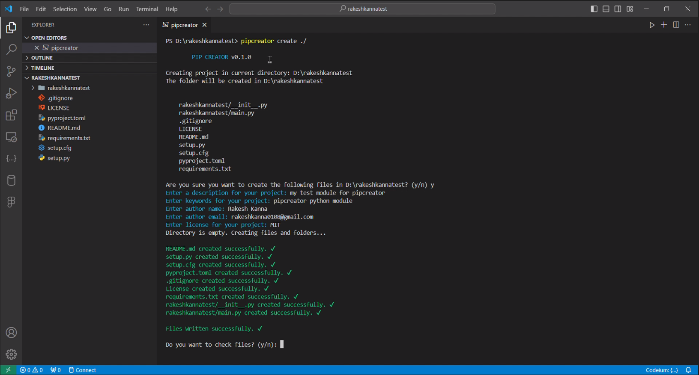
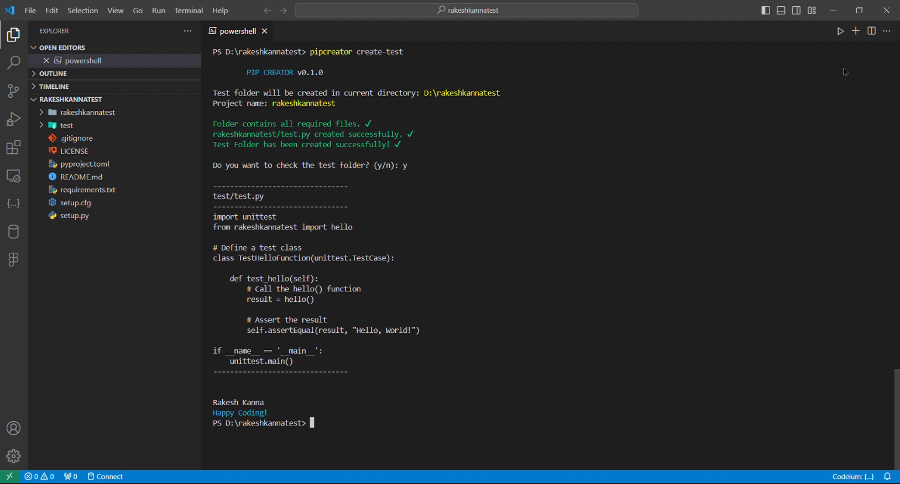
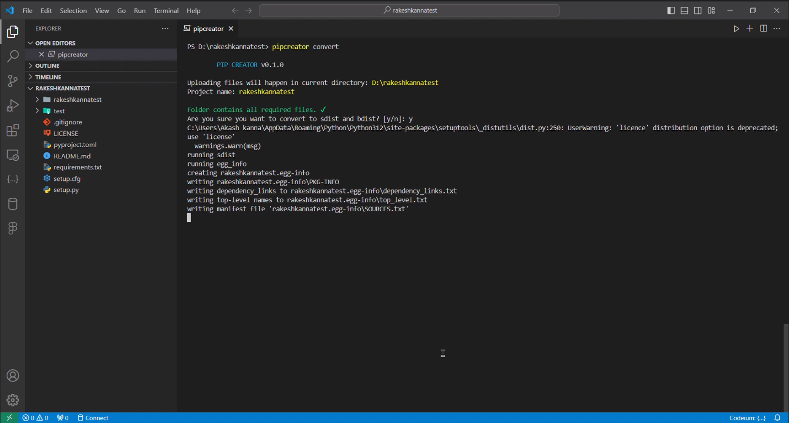
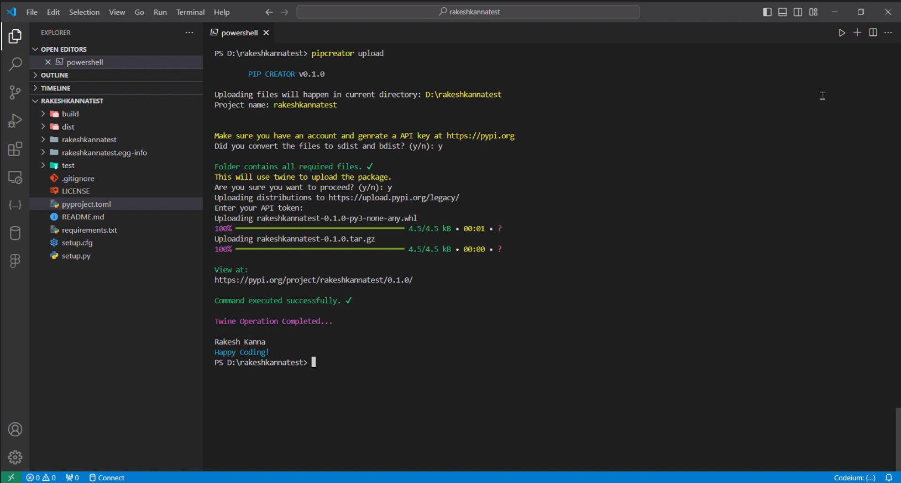

# PIP CREATOR v0.1.0

PIP CREATOR is a command-line interface tool designed to streamline the process of creating, testing, converting, and uploading Python modules to PyPI (Python Package Index). With this tool, developers can easily generate all necessary files and folders for their Python modules, edit or update existing code, create test suites, convert their code to distribution formats, and seamlessly upload their packages to PyPI.

> [!WARNING]
> This tool is in **BETA**/**DEVELOPMENT** stage. It may contain bugs or incomplete features at current versions `v0.1.0b1`.

## Features

- **File Generation**: Automatically create all necessary files and folders for a Python module, including `.gitignore`, `LICENSE`, `README.md`, `setup.py`, `setup.cfg`, `pyproject.toml`, `requirements.txt`, `project/__init__.py`, and `project/main.py`.
- **Customizable Code**: Pre-written basic code is provided in the generated files, allowing users to easily edit or update the code according to their requirements.
- **Test Suite Creation**: Generate a test folder with the necessary structure for testing the Python module.
- **Conversion to Distribution Formats**: Convert Python modules to distribution formats (`bdist`, `sdist`, `wheel`) with automatic validation of necessary files.
- **PyPI Upload**: Seamlessly upload Python packages to PyPI using Twine.
- **CLI Guide**: Access a short guide within the CLI on how to create, convert, and upload Python libraries.

## Installation

```bash
pip install pipCreator
```

## Usage

### Creating Python Module Files and Folders

```bash
pipcreator create <location>
```

This command will generate all necessary files and folders for a Python module in the specified `<location>`. The generated files include `.gitignore`, `LICENSE`, `README.md`, `setup.py`, `setup.cfg`, `pyproject.toml`, `requirements.txt`, `project/__init__.py`, and `project/main.py`.

### Creating Test Suite

```bash
pipcreator create-test
```

This command will create a test folder with the necessary structure for testing the Python module.

### Converting to Distribution Formats

```bash
pipcreator convert
```

Convert the Python module to distribution formats (`bdist`, `sdist`, `wheel`). This command automatically checks whether all necessary files exist before conversion.

### Uploading to PyPI

```bash
pipcreator upload
```

Upload the Python package to PyPI using Twine.

### CLI Guide

```bash
pipcreator guide
```

Access a short guide within the CLI on how to create, convert, and upload Python libraries.

## Examples

### Creating files on current opened folder

```bash
PS D:\PyModule> pipcreator create ./

        PIP CREATOR v0.1.0

Creating project in current directory: D:\PyModule
The folder will be created in D:\PyModule


    PyModule/__init__.py
    PyModule/main.py
    .gitignore
    LICENSE
    README.md
    setup.py
    setup.cfg
    pyproject.toml
    requirements.txt

Are you sure you want to create the following files in D:\PyModule? (y/n) y
Enter a description for your project: My first python library
Enter keywords for your project: first python library
Enter author name: Rakesh Kanna
Enter author email: rakeshkanna0108@gmail.com
Enter license for your project: MIT
Directory is empty. Creating files and folders...

README.md created successfully. ✔
setup.py created successfully. ✔
setup.cfg created successfully. ✔
pyproject.toml created successfully. ✔
.gitignore created successfully. ✔
License created successfully. ✔
requirements.txt created successfully. ✔
PyModule/__init__.py created successfully. ✔
PyModule/main.py created successfully. ✔

Files Written successfully. ✔

Do you want to check files? (y/n): y

--------------------------------
README.md

# PyModule
My first python library

--------------------------------

--------------------------------
setup.py

from setuptools import setup, find_packages

with open("README.md", "r", encoding="utf-8") as fh:
    long_description = fh.read()

setup(
    name="PyModule",
    version="0.1.0",
    description="My first python library",
    author="Rakesh Kanna",
    author_email='rakeshkanna0108@gmail.com',
    licence="MIT",
    long_description=long_description,
    long_description_content_type="text/markdown",
    packages=find_packages(),
    keywords=['first', 'python', 'library'],
)

--------------------------------

--------------------------------
setup.cfg

[metadata]
name = PyModule
version = 0.1.0
description = My first python library
author = Rakesh Kanna
author_email = rakeshkanna0108@gmail.com
license = MIT
keywords = first, python, library

[options]
packages = find:
python_requires = >=3.6

--------------------------------

--------------------------------
pyproject.toml

[tool.poetry]
name = "PyModule"
version = "0.1.0"
description = "My first python library"
author = "Rakesh Kanna"
author_email = "rakeshkanna0108@gmail.com"
license = "MIT"
keywords = ['first', 'python', 'library']
[tool.poetry.dependencies]
python = ">=3.6"

[build-system]
requires = ["poetry-core>=1.0.0"]
build-backend = "poetry.core.masonry.api"

--------------------------------

--------------------------------
requirements.txt
# your requirements here


--------------------------------
.gitignore

# Byte-compiled / optimized Python files
__pycache__/
*.pyc
*.pyo
*.pyd

# Virtual environment
venv/
env/
*.env

# Compiled files
*.o
*.class
*.dll
*.exe

# Temporary files
*~
*.swp
*.log

# Miscellaneous
.DS_Store
.idea/
.vscode/

--------------------------------

--------------------------------
PyModule/__init__.py

from .main import main

__all__ = ["main"]

--------------------------------

--------------------------------
PyModule/main.py

def main():
    print("Hello, World!")

--------------------------------


All files created successfully. ✔
Your project folder is ready to use.

         cd D:\PyModule

Rakesh Kanna
Happy Coding!
```

### You can also create in different loaction using

```bash
pipcreator create ./NewModule
```

```bash
pipcreator create NewModule
```

```bash
pipcreator create ../New/NewModule
```

### Creating Test Folder

```bash
PS D:\PyModule> pipcreator create-test

        PIP CREATOR v0.1.0

Test folder will be created in current directory: D:\PyModule
Project name: PyModule

Folder contains all required files. ✔
PyModule/test.py created successfully. ✔
Test Folder has been created successfully! ✔

Do you want to check the test folder? (y/n): y

--------------------------------
test/test.py
--------------------------------
import unittest
from PyModule import hello

# Define a test class
class TestHelloFunction(unittest.TestCase):

    def test_hello(self):
        # Call the hello() function
        result = hello()

        # Assert the result
        self.assertEqual(result, "Hello, World!")

if __name__ == '__main__':
    unittest.main()
--------------------------------


Rakesh Kanna
Happy Coding!
```

### Converting to sdist bdist wheel file

```bash
PS D:\PyModule> pipcreator convert    

        PIP CREATOR v0.1.0

Uploading files will happen in current directory: D:\PyModule
Project name: PyModule

Folder contains all required files. ✔
Are you sure you want to convert to sdist and bdist? [y/n]: y

<Convertion process>

Command executed successfully. ✔

Files Converted successfully. ✔

Rakesh Kanna
Happy Coding!
```

### Uploading your module to PyPI

```bash
PS D:\PyModule> pipcreator upload 

        PIP CREATOR v0.1.0

Uploading files will happen in current directory: D:\PyModule
Project name: PyModule


Make sure you have an account and genrate a API key at https://pypi.org
Are you sure you want to convert to sdist and bdist? [y/n]: y
Folder contains all required files. ✔
This will use twine to upload the package. 

<uploading process>

Package has uploaded/not uploaded as per the twine

Rakesh Kanna
Happy Coding!
```

### Guide

```powershell
PS D:\PyModule> pipcreator guide 

        PIP CREATOR v0.1.0

Author:Rakesh Kanna

Let's get started!

1.  On first let create the project folder.
    USE: pipcreator create <location>
    this command will create the project folder in the location specified.

2.  Edit the inner folder files that as same name as the project folder.

3.  Edit the folder as you want and have a __init__.py file, to initiate the project.

4.  Also Edit the README.md, setup.py, setup.cfg, pyproject.toml and requirements.txt file.
    for more metadata information and setup details.

5.  Convert the project folder to python package.
    USE: pipcreator convert
    this will create the wheel and sdist for the project.

6.  Upload the project folder to pypi.
    USE: pipcreator upload
    this will upload the project folder to pypi.
    this command uses twine. to upload the project folder to pypi.
    make sure you have an account on https://pypi.org .

you can also refer some YouTube videos for more guidence.
https://www.youtube.com/results?search_query=how+to+create+a+python+library

Rakesh Kanna
Happy Coding!
```

## Videos

[](https://youtu.be/tGk1lfvgPm4)
[](https://youtu.be/mapwG-p38Wc)
[](https://youtu.be/cUyHq12RugQ)
[](https://youtu.be/ATzg7JmP1CE)

## Contributing

Contributions are welcome! Please feel free to submit issues or pull requests.

## License

This project is licensed under the terms of the MIT license. See the [LICENSE](LICENSE) file for details.

## Author Details

Author  : **Rakesh Kanna**  
Mail    : [rakeshkanna0108@gmail.com](mailto:rakeshkanna0108@gmail.com)  
Github  : [@rakeshkanna-rk](https://github.com/rakeshkanna-rk)
GitHub  : [PipCreator](https://github.com/rakeshkanna-rk/pipCreator/)  
PyPI    : [PipCreator](https://pypi.org/project/PipCreator/)  
